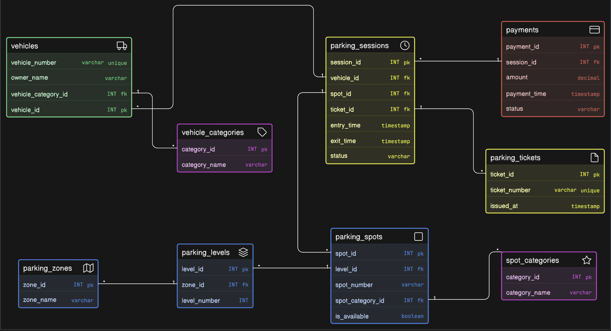

# 🚗 Comic-Con Event Parking System – ER Diagram

This repository contains the **Entity-Relationship (ER) Diagram** for a multi-zone parking management system designed for large-scale events like Comic-Con India.

---

## 📌 Problem Overview

A convention venue hosting Comic-Con needs a structured system to manage:

* Vehicle entries and exits
* Different vehicle types (bike, car, SUV, EV, etc.)
* Parking zones and levels
* Reserved parking categories (VIP, exhibitors, staff, cosplayers, EV charging)
* Parking spot allocation
* Parking tickets and sessions
* Payment tracking

The system must support **high traffic, multi-day usage**, and real-time parking availability.

---

## 🧠 System Workflow

The system operates as follows:

1. **Vehicle enters the venue**
2. **Parking ticket is generated**
3. **Parking spot is assigned based on type & availability**
4. **Parking session starts (entry time recorded)**
5. **Vehicle exits → session ends (exit time recorded)**
6. **Parking fee is calculated**
7. **Payment is processed and recorded**

---

## 🧱 Entities Covered

### 🟢 Vehicle Domain

* Vehicles
* Vehicle Categories

### 🔵 Parking Infrastructure

* Parking Zones / Levels
* Parking Spots
* Spot Categories (normal, VIP, EV, etc.)

### 🟡 Parking Operations

* Parking Tickets
* Parking Sessions

### 🔴 Payments

* Payment Records

---

## 🔗 Key Relationships

* One **vehicle** can have multiple parking sessions
* One **parking spot** can be reused across many sessions
* Each **session** is linked to:

  * a vehicle
  * a parking spot
  * a ticket
* Parking spots belong to **zones/levels**
* Parking spots can have **reserved categories**
* Payments are linked to **parking sessions**

---

## 🧩 Design Highlights

* Separation of **ticket and parking session** for better tracking
* Parking spots linked to **zones and levels** for structured layout
* Reserved categories handled via **spot categories**
* Supports **multiple visits by same vehicle across event days**
* Tracks **real-time availability and currently parked vehicles**
* Clean handling of **entry/exit timestamps**
* Spot reuse modeled correctly over time

---

## 📷 ER Diagram

---

## 🚀 Tools Used

* Eraser (for ER diagram design)
* GitHub (for version control and sharing)

---

## 📈 Evaluation Focus

This design ensures:

* ✔ Multi-zone parking system understanding
* ✔ Proper entity separation (vehicles, spots, sessions, tickets, payments)
* ✔ Accurate relationship modeling
* ✔ Correct use of primary and foreign keys
* ✔ Real-world practicality and scalability

---

## 📌 Conclusion

This ER diagram provides a scalable and structured approach to managing event-based parking systems. It supports high traffic scenarios, multiple vehicle types, reserved parking, and real-time session tracking, making it suitable for large conventions like Comic-Con.

---
